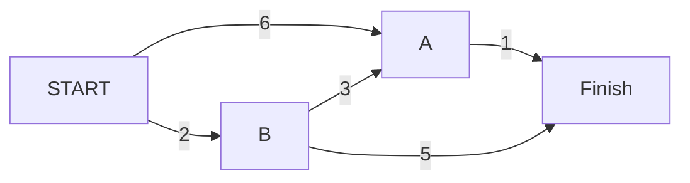

# Algorithm
#DijkstraAlgorithm #GreedyAlgorithm 
- Dijkstra's algorithm works even if there is a cycle, as long as it is a positive weight cycle.
- “What’s the shortest time to X?” for #WeightedGraphs 
- Find the path with the smallest total weight
- Each edge has a weight (travel time in minute)

- Negative-Weight Edges: Dijkstra’s algorithm assumed that because you were processing the poster node, there was no cheapest way to get to that node. So you can’t use negative-weight edges with Dijkstra’s algorithm. Use #BallmanFordAlgorithm 
- Algorithm:
	- Build a table with weight and parent of every node. Put infinity for node that we don't know yet
		- START->A: 6, START->B: 2, ?->Finish: $\infty$
	- Find the cheapest node. This is the node you can get to in the least amount of time. =>B
	- Calculate how lond it takes to all B's neighbor (A and Finish), check whether there’s a cheaper path. If so, update their costs and parents.
		- B->A:5, B->Finish:7
	- Repeat until you've done this for every node in the graph, so the nearest node is A now
	- Update the costs for node A’s neighbors
		- A->Finish: 5
	- Final table
Parent  | Node | Cost
------------- | ------------- | -------------
B  | A | 5
START  | B | 2
A  | Finish | 6
	- We can see that the shortest path to Finish costs 6
	- How do you figure out the path? To start with, look at the parent for 
	  Finish -> A -> B -> Start


# Data Structure Used
The graph
```
graph = {}
graph["start"] = {}
graph["start"]["a"] = 6
graph["start"]["b"] = 2

graph["a"] = {}
graph["a"]["fin"] = 1

graph["b"] = {}
graph["b"]["a"] = 3
graph["b"]["fin"] = 5

graph["fin"] = {}
```

# Python Code
Get the final costs table and calculate the final path.

```
def get_final_costs_table(graph):
    # Build a table with weight and parent of every node.
    # To avoid adding duplicated node, we use node as key and put parent and weight in a tuple
    costs_table = {}
    # for every node in graph, we start with "Book" here
    for node, neighbors in graph.items():
        # start with the cheapest neighbor. This is the node you can get to in the least amount of time
        for nei, weight in dict(sorted(graph[node].items(), key=lambda item: item[1])).items():
            # if neighbor is not in result table
            if not nei in costs_table.keys():
                # add it in
                costs_table[nei] = (node, weight)
            else:
                # if neighbor is already in result table, but here we find another path with lowest weight
                if costs_table[nei][1] > weight:
                    # update the parent and weight
                    costs_table[nei] = (node, weight)
    return costs_table

def calculate_final_path(costs_table, start, end):
    '''
    Calculate the final path
    -------------------------
    costs_table
    start: the last node of the graph
    end: the first node of the graph
    '''
    final_weight = 0
    final_path = []
    while start != end: # if not reach the start of the graph
        final_path.append(start) # add path
        parent, weight = costs_table[start]
        final_weight += weight # add weight
        start = parent # update start to the parent of this node
    print("Total weight: ", final_weight)
    print("Final path:", final_path)
    return final_weight, final_path


costs_table = get_final_costs_table(graph)
for node in graph.keys():
    print(node)
    calculate_final_path(costs_table, start=node, end="start")
-----
start
Total weight:  0
Final path: []
a
Total weight:  5
Final path: ['a', 'b']
b
Total weight:  2
Final path: ['b']
fin
Total weight:  6
Final path: ['fin', 'a', 'b']
```

# Python Code
Resource: https://github.com/Hsuning/grokking_algorithms/blob/master/07_dijkstras_algorithm/python/01_dijkstras_algorithm.py
Find the cheapest cost for every node.
```
# the costs table
infinity = float("inf")
costs = {}
costs["a"] = 6
costs["b"] = 2
costs["fin"] = infinity

# the parents table
parents = {}
parents["a"] = "start"
parents["b"] = "start"
parents["fin"] = None

processed = []

def find_lowest_cost_node(costs):
    lowest_cost = float("inf")
    lowest_cost_node = None
    # Go through each node.
    for node in costs:
        cost = costs[node]
        # If it's the lowest cost so far and hasn't been processed yet...
        if cost < lowest_cost and node not in processed:
            # ... set it as the new lowest-cost node.
            lowest_cost = cost
            lowest_cost_node = node
            
    return lowest_cost_node

# Find the lowest-cost node that you haven't processed yet.
node = find_lowest_cost_node(costs)
# If you've processed all the nodes, this while loop is done.
while node is not None:
    cost = costs[node]
    # Go through all the neighbors of this node.
    neighbors = graph[node]
    for n in neighbors.keys():
        new_cost = cost + neighbors[n]
        # If it's cheaper to get to this neighbor by going through this node...
        if costs[n] > new_cost:
            # ... update the cost for this node.
            costs[n] = new_cost
            # This node becomes the new parent for this neighbor.
            parents[n] = node
    # Mark the node as processed.
    processed.append(node)
    # Find the next node to process, and loop.
    node = find_lowest_cost_node(costs)

print("Cost from the start to each node:")
print(costs)
```