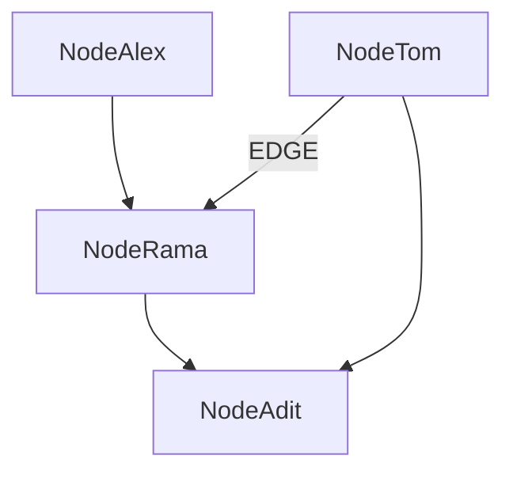

#Graphs

- Each graph is made up of nodes and edges:

```mermaid
  graph TD;
      NodeAlex-->NodeRama;
      NodeTom-->|EDGE| NodeRama;
      NodeRama-->NodeAdit;
      NodeTom-->NodeAdit;
```
- directed versus undirected graphs
- 