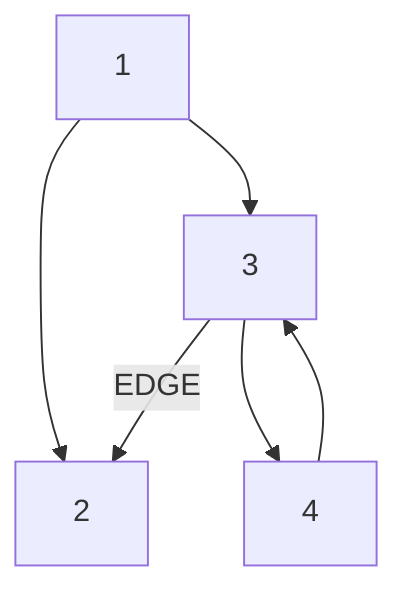
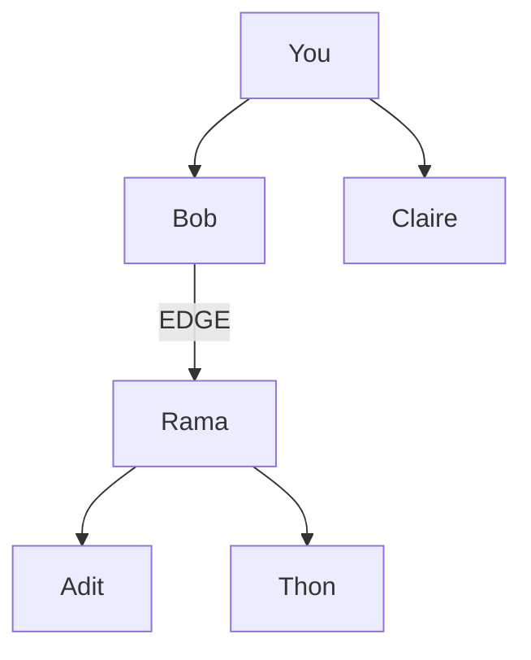
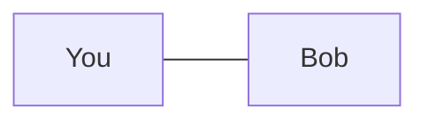

#Graphs

- Each graph is made up of nodes and edges:
- Each node is connected to neighboring nodes.
- Use #HashTable to express a relationship like NodeAlex-> NodeRama, by mapping a node to all of its neighbors
```
graph = {}
graph["You"] = ["Bob", "Claire"]
graph["Bob"] = ["Rama"]
graph["Rama"] = ["Adit", "Thon"]
```


#DirectedGraphs 
- Directed graph have edges with direction. 
- The relationship is only one-way, in that each edge can only be traversed in a single direction. 


#DirectedAcyclicGraphs
- A directed graph with no directed cycles.
- A directed acyclic graph means that the graph is not cyclic, or that it is impossible to start at one point in the graph and traverse the entire graph. 
- Each edge is directed from an earlier edge to a later edge.


#UndirectedGraphs
- Undirected graphs have edges that do not have a direction. 
- The relationship is two-way. Both nodes are each other's neighbors.


#Tree
- A special type of graph, where no edges ever point back.

